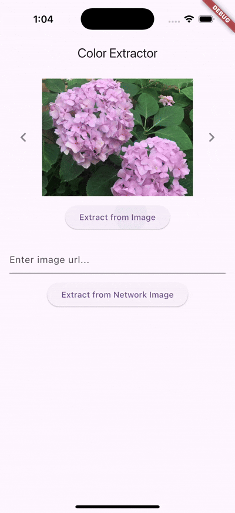

# Color Extractor

[![style: very good analysis][very_good_analysis_badge]][very_good_analysis_link]
[](https://github.com/felangel/mason)
[![License: MIT][license_badge]][license_link]

A simple Flutter package for extracting the most dominant colors from images, with results sorted from highest to lowest percentage contribution.

## Installation

**❗ In order to start using Color Extractor you must have the [Flutter SDK][flutter_install_link] installed on your machine.**

Install via `flutter pub add`:

```sh
dart pub add color_extractor
```

---

## Features

- Extract dominant colors from asset (local) images
- Extract dominant colors from network (remote) images
- Returns a `List<Color>` ordered by descending percentage (highest coverage first)
- Easy-to-use API compatible with any Flutter project

---

## Usage

Import the package:

```dart
import 'package:color_extractor/color_extractor.dart';
```

### Extract from asset images

```dart
final extractor = const ColorExtractor();
final bytes = await rootBundle.load('assets/sample1.jpeg');
final data = bytes.buffer.asUint8List();
final colors = await extractor.extractColorsFromBytes(data);
```

### Extract from network images

```dart
final extractor = const ColorExtractor();
final colors = await extractor.extractColorsFromNetwork('https://example.com/image.jpg');
```

## Demo



## API Reference

### `ColorExtractor`

| Method                                                                         | Description                                                             |
| ------------------------------------------------------------------------------ | ----------------------------------------------------------------------- |
| `Future<List<Color>> extractColorsFromBytes(Uint8List bytes)`                  | Extracts dominant colors from raw image bytes, sorted by coverage.      |
| `Future<List<Color>> extractColorsFromNetwork(String url)`                     | Fetches an image from a URL and extracts dominant colors.               |
| `Future<List<Color>> extractColorsFromextractColorsFromPath(String imagePath)` | Converts the path to a file and extract dominant colors from the image. |

---

## License

This project is licensed under the MIT License - see the [LICENSE](LICENSE) file for details.

[flutter_install_link]: https://docs.flutter.dev/get-started/install
[github_actions_link]: https://docs.github.com/en/actions/learn-github-actions
[license_badge]: https://img.shields.io/badge/license-MIT-blue.svg
[license_link]: https://opensource.org/licenses/MIT
[logo_black]: https://raw.githubusercontent.com/VGVentures/very_good_brand/main/styles/README/vgv_logo_black.png#gh-light-mode-only
[logo_white]: https://raw.githubusercontent.com/VGVentures/very_good_brand/main/styles/README/vgv_logo_white.png#gh-dark-mode-only
[mason_link]: https://github.com/felangel/mason
[very_good_analysis_badge]: https://img.shields.io/badge/style-very_good_analysis-B22C89.svg
[very_good_analysis_link]: https://pub.dev/packages/very_good_analysis
[very_good_cli_link]: https://pub.dev/packages/very_good_cli
[very_good_coverage_link]: https://github.com/marketplace/actions/very-good-coverage
[very_good_ventures_link]: https://verygood.ventures
[very_good_ventures_link_light]: https://verygood.ventures#gh-light-mode-only
[very_good_ventures_link_dark]: https://verygood.ventures#gh-dark-mode-only
[very_good_workflows_link]: https://github.com/VeryGoodOpenSource/very_good_workflows
